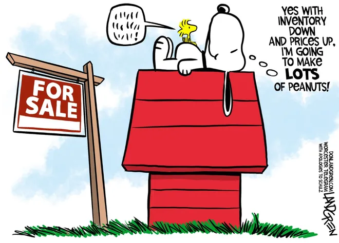

```{r setup, include=FALSE}
knitr::opts_chunk$set(echo = TRUE,
                      warning = FALSE,
                      error = FALSE,
                      message = FALSE)
```

# Relatório Aula 4

Nesta aula, foram apresentados os conceitos de visualização de dados, e modelagem a partir dos pacotes
ggplot e corrplot. Em adição, foram estudados:
  
  + Estrutura de repetição;
  
  + Teste de normalidade;
  
  + Construção de relatórios
  
## Marcações de texto

Subscrito: CO~2~ = `CO~2~`

Negrito: palavra **em negrito** = `palavra **em negrito**`

Itálico: palavra *em itálico* = `palavra *em itálico*` 

## Adicionando uma imagem


FONTE: [LINK](https://www.telegram.com/story/opinion/2021/04/23/peanuts-snoopy-cartoon-don-landgren/7332261002/)

## Adição de vídeos, utilize o código de incorporação

<iframe width="640" height="360" src="https://www.youtube.com/embed/rzFX5NWojp0" title="The Normal Distribution, Clearly Explained!!!" frameborder="0" allow="accelerometer; autoplay; clipboard-write; encrypted-media; gyroscope; picture-in-picture; web-share" allowfullscreen></iframe>


## Criação de Um modelo matemático

Modelo fatorial de dois fatores

$$
y_{ij} = \mu+\alpha_i+\beta_j+(\alpha \beta)_{ij} + \epsilon_{ij}
$$

Função densidade normal

$$
f(x)=\frac{1}{\sqrt{2\pi\sigma^2}} e^{-\frac{1}{2}\frac{(x-\mu)^2}{\sigma^2} }
$$
## Criação de Tabela

Tratamento | Rep.1 | Rep.2 | Rep.3 | Total
:---|:---:|:---:|:---:|---:
T1 | 4 | 5 | 3 | 12
T2 | 8 | 7 | 10 | 25
T3 | 9 | 4 | 12 | 25

## Trechos de códigos do R (Chunk).

Para gerar um trecho de código use o comando

**Control + Alt + i**

### Carregando os pacotes
```{r}
library(tidyverse)
library(readxl)
```

### Lendo o arquivo geomorfologia
```{r}
geomorfologia <- read_rds("../data/geomorfologia.rds")
```

### Resumo do banco de dados

```{r}
skimr::skim(geomorfologia)
```


### Criando um histograma de argila

```{r}
geomorfologia %>% 
  ggplot(aes(x=argila, y=..density..)) +
  geom_histogram(bins=10,color="black",fill="gray")+
  theme_bw()
```


### Adicionar o gráfico de corrplot

```{r}
geomorfologia %>%
  select(where(is.numeric),
         -c(amostra,x)) %>%
  cor() %>%
  corrplot::corrplot()
```


